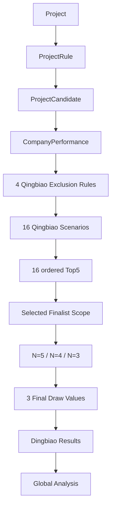

# 2026-08-20 业务原型对齐与差异审计

## 0. 文档目的与结论

本文以 `docs/reference/投标伴侣方案设计_20260820.xlsx` 为最新版业务原型，对 v0.1.0 MVP 的文档、Prisma 模型、清标/定标/履约/分析 domain、application、repository、UI、Excel 导入和回归测试进行只读审计，建立后续改造的业务规则基线。

本次审计不修改 Prisma schema、domain calculator、repository、React 页面、migration 或既有测试预期。

核心结论如下：

1. 新版清标不再是只有 `qingbiaoK2 = 0% / 1% / 2% / 3%` 的 4 个场景，而是 **4 种推优单位剔除规则 × 4 种清标 K2 = 16 个场景**。
2. 推优单位选择的目的，是先按每种剔除规则生成一个清标 K1；K2 再与该 K1 组合计算参考报价 B。当前系统把候选单位选择直接挂在 K2 上，并把所选单位投标报价平均值当作 B，计算次序和选择语义均不符合新版原型。
3. 定标不能只用 `qingbiaoK2` 定位来源，必须使用 `exclusionRule + qingbiaoK2`，更稳妥的方式是直接使用唯一 `qingbiaoScenarioId`。
4. 比例内部必须统一为 decimal fraction：`10% = 0.10`、`1% = 0.01`。当前表单和导入多数已按 fraction 保存，但清标 K1、清标 K2、定标 domain、部分 UI formatter 和旧测试仍混用 percentage point。
5. 新版 Excel 的 N=5 M 公式与 N=4/N=3 文本公式互相冲突。该冲突必须在编码前由业务确认；`calculateFinalBenchmarkPrice()` 必须继续是 M 值唯一公式入口。
6. 最新 Excel 是文字方案原型：四个 Sheet 中没有可执行公式、数值样例或数据验证规则，单元格内容主要是字段说明和占位文本。因此编码前必须补充经业务签署的黄金数值夹具。

本文中的规则状态分为：

- **已确认基线**：本次需求明确指定，可作为新版设计输入。
- **Excel 明示**：最新版 Excel 文字明确表达，但仍可能与其他单元格冲突。
- **待业务确认**：Excel 未定义、定义冲突，或当前实现使用了临时规则。

## 1. 最新版 Excel 四个 Sheet 的职责

| Sheet | 职责 | 主要输入 | 主要输出/下游 |
| --- | --- | --- | --- |
| 参数设置 | 维护项目、清标、定标及候选单位基础输入 | 项目名称、限价、不可竞争费、项目类型、评分参数、3 个定标抽值、候选单位报价和评分 | 履约按项目类型查询；清标读取项目规则和候选单位；定标读取限价、费用和抽值 |
| 履约信息 | 维护单位在各项目类型下的季度履约评分，并形成最近 12 季度专业平均 | 单位名称、项目类型、分类分级、季度评分 | 清标中的履约加权平均分和履约得分 |
| 清标测算 | 针对 4 种推优剔除规则分别计算 K1，再与 4 个 K2 组合形成 16 套清标排名和 Top5 | 参数设置、候选单位、履约平均、4 组剔除单位选择 | 16 个清标场景、16 个有序 Top5、“全场景入围单位”选项 |
| 定标测算 | 从一套具体清标场景的有序 Top5 派生 N=5/4/3，并与 3 个定标抽值组合预测结果 | 被选中的清标场景、Top N、候选报价和净下浮率、项目限价和费用、3 个定标抽值 | 定标 K1、M、差额、排名、预测中标单位、模拟中标率和全局分析输入 |

## 2. 四个 Sheet 的字段级数据流

### 2.1 参数设置

| Excel 区域 | 字段 | 目标语义 | 下游 |
| --- | --- | --- | --- |
| `A2:B2` | 项目名称 | 项目业务标识 | 全流程展示、报告 |
| `A3:B3` | 最高投标限价 | 金额，万元 | 清标 B、定标 M |
| `C3:D3` | 不可竞争费 | 金额，万元 | 清标 B、定标 M |
| `E3:F3` | 项目类型 | 幕墙/装修/总包/实验室，多选 | 履约查询与多专业平均 |
| `A6:B6` | 总投标报价分值 | 报价排名第 1 名的基准报价分 | 清标报价得分 |
| `A7:B7` | 排名递减扣分值 | 相邻报价名次的扣分 | 清标报价得分 |
| `C6:D7` | 同类业绩分值 | 原型中出现两次同名参数 | 语义未明确，见待确认项 |
| `E6:F7` | 其他主客观分值 | 原型中出现两次同名参数 | 语义未明确，见待确认项 |
| `A10:D10` | 定标抽值 1/2/3 | UI 以百分数录入，内部应为 fraction | 每个 N 的 3 个定标场景 |
| `A13:H15` | 候选单位 | 序号、名称、投标总价、净下浮率、商标优、技术优、同类业绩、其他主客观分 | 清标与定标 |

字段级依赖：

```text
maxBidPrice + nonCompetitiveFee
  ├─> 16 个清标参考报价 B
  └─> 定标 M

projectTypes + candidate.companyName
  └─> 最近 12 季度履约专业平均

totalBidPriceScore + rankDeduction
  └─> 每个清标场景的 priceScore

finalDrawValue1/2/3
  └─> 每个 N 下的 3 个定标场景

candidate.netDiscountRate
  ├─> 4 个推优剔除规则各自的 qingbiaoK1
  └─> N=5/4/3 各自的 dingbiaoK1
```

注意：参数设置中的“同类业绩分值”和“其他主客观分值”各出现两次，而候选单位表又保存每家单位的同名得分。清标 Sheet 的字段说明也在“清标参数”和“候选单位信息”之间出现来源表述不一致，当前不能判断参数区字段是分值上限、两个评分子项，还是重复占位行。

### 2.2 履约信息

| Excel 区域 | 字段 | 目标语义 | 下游 |
| --- | --- | --- | --- |
| `B3` | 单位名称 | 与候选单位名称匹配 | 候选单位履约聚合 |
| `C3` | 类型 | 单一项目类型/专业 | 按专业独立取最近 12 季度 |
| `D3` | 分类分级等级 | 履约记录附加属性 | 当前没有明确进入平均公式 |
| `E3:U3` | 2022Q2 至 2026Q2 季度平均分 | 宽表中的季度评分列；实际系统应支持滚动新增季度 | 最近 12 季度平均 |
| `V3:V4` | 加权平均分 | 最新 12 个季度的专业平均 | 清标履约平均输入 |

已确认基线：

1. 以 `候选单位名称 + 项目类型` 查询记录。
2. 每个项目类型独立选择最近 12 个季度。
3. 当前临时采用季度等权平均。
4. 一个项目有多个项目类型时，先计算各专业平均，再对专业平均值取等权平均。
5. Excel 使用“加权平均”措辞，但没有给出季度权重、分类等级权重或专业权重，仍须标记为待业务确认。

当前 domain 的 `calculateRecentPerformanceAverage()` 与上述临时口径一致：按专业截取最近 12 条、专业内等权平均、再对专业平均等权平均；任一必要专业缺失时返回缺失状态，不以 0 分替代。

### 2.3 清标测算

| Excel 区域 | 字段/动作 | 数据来源或规则 |
| --- | --- | --- |
| `J4:L4` | 4 种推优单位剔除规则及各自剔除单位选择 | 用户先完成 4 组选择，才可执行清标 |
| `A6:F8` | 单位、报价、净下浮率、商标优、技术优 | 参数设置中的候选单位 |
| `G6:G8` | 总投标报价分值 | 原型数据行写“放空，不计算”；实际作为 priceScore 基准参数使用 |
| `H6:H8` | 履约加权平均分 | 单位名称 + 项目类型，从履约信息取得 |
| `I7:I8` | 履约得分 | `10 × (A - Amin) / (Amax - Amin)` |
| `J6:K8` | 同类业绩、其他主客观分 | 候选单位评分输入；原型来源文字存在前述矛盾 |
| `L6:L8` | 平均值 K1 | 由当前推优剔除规则对应的剩余单位净下浮率生成 |
| `M7:P8` | K2=0%/1%/2%/3% 的综合得分 | K2 单元格实际为 `0 / 0.01 / 0.02 / 0.03` 并按百分比格式显示 |
| `Q7:AF8` | 每个 K2 的 B、差值、排序、报价分 | 每个推优规则下分别计算四组 |
| `A10:AF11` | 清标结论模板 | 为 4 种推优剔除规则分别输出 K2=0%/1%/2%/3% 的 Top5 |

Excel 的 `L8` 同时把字母 B 写成“剩余单位下浮率平均值”，而 `Q8/U8/Y8/AC8` 又把 B 定义为金额参考报价。这是同一符号被复用造成的文字歧义。本文采用本次需求明确的新版口径：**剩余单位下浮率的去重平均得到清标 K1；金额 B 由 K1、K2、限价和不可竞争费计算。**

### 2.4 定标测算

| Excel 区域 | 字段/动作 | 数据来源或规则 |
| --- | --- | --- |
| `B1:C1` | 最终定标单位范围 | 下拉选择清标中的“全场景入围单位”；必须指向一套具体清标场景 |
| `A4:M11` | N=5 | 所选清标场景的有序 Top5 |
| `A13:M19` | N=4 | 所选 Top5 的前 4 名；原型数据行仍误写“前5家单位” |
| `A21:M26` | N=3 | 所选 Top5 的前 3 名；原型数据行仍误写“前5家单位” |
| `D4:D24` | 定标 K1 | 当前 N 内所有单位净下浮率平均值 |
| `E/H/K` 组 | 3 个定标抽值 | 参数设置的抽值 1/2/3 |
| `E/F/G`、`H/I/J`、`K/L/M` | M、差额、排名 | 每个 N × 每个抽值独立计算 |
| `A29:F30` | 定标结论和全局汇总模板 | 汇总中标单位、模拟中标率和跨场景结论 |

N=5 的 Excel 文本公式为：

```text
M = (100 - K1 - 定标抽值) / 100
    × (最高投标限价 - 不可竞争费)
    + 不可竞争费
```

如果内部统一使用 fraction，等价形式是：

```text
M = (1 - dingbiaoK1 - finalDrawValue)
    × (maxBidPrice - nonCompetitiveFee)
    + nonCompetitiveFee
```

但 N=4、N=3 仍写旧公式：

```text
M = (K1 + 定标抽值) / 100
    × (最高投标限价 - 不可竞争费)
    + 不可竞争费
```

两者业务方向相反，属于 P0 冲突。本步骤不选择任何一方，也不修改现有实现。

## 3. 参数设置 → 履约 → 清标 → 定标完整流程

### 3.1 项目与候选输入

1. 创建 Project，设置最高投标限价、不可竞争费和一个或多个项目类型。
2. 设置清标报价分值与排名递减扣分。
3. 设置 3 个定标抽值；UI 输入百分数，保存为 decimal fraction。
4. 录入候选单位名称、投标总价、净下浮率和各评分项。
5. 明确标记我方单位。最新版 Excel 结论模板硬编码了“深圳广田集团股份有限公司”，但系统不应以名称承担我方识别逻辑。

### 3.2 履约聚合

对每个候选单位：

```text
候选单位名称 + 项目类型
  -> 每个专业按 year/quarter 倒序
  -> 每个专业取最近最多 12 季度
  -> 专业内季度平均（当前临时等权）
  -> 多专业时对专业平均再取平均（当前临时等权）
  -> candidate.performanceAverage
```

然后在同一清标计算批次的候选单位间计算：

```text
Amax = max(performanceAverage)
Amin = min(performanceAverage)
performanceScore = 10 × (A - Amin) / (Amax - Amin)
```

当 `Amax = Amin` 时，当前代码统一给 10 分；Excel 未定义该边界，仍需业务确认。

### 3.3 4 个推优剔除规则与清标 K1

用户先为 4 个推优剔除规则分别选择剔除单位。规则标识必须稳定且不能只依赖展示文案；Excel 当前以“（1）/（2）/（⅓）/（¼）”区分，但这些标识究竟表示固定序号、剔除数量还是剔除比例，尚未明确。

对每个推优剔除规则 `R`：

```text
allCandidates
  -> remove R.excludedCandidates
  -> remaining netDiscountRate fractions
  -> × 100 转为百分点
  -> 四舍五入到整数百分点
  -> 去除重复整数值
  -> 对唯一值求平均
  -> ÷ 100 转回 fraction
  -> qingbiaoK1Rate(R)
```

目标内部表达可写为：

```text
roundedPoints_i = roundToIntegerPercentagePoint(netDiscountRate_i × 100)
qingbiaoK1Rate = average(distinct(roundedPoints_i)) / 100
```

例如 `10.38%` 的内部值是 `0.1038`，转为 `10.38` 个百分点后取整，再参与去重平均。准确的 `.5` 中点舍入模式和空集合处理需要黄金样例确认。

该剔除集合用于生成 K1。按本次需求的流程解释，后续报价与综合排名仍覆盖全部候选单位；是否要把被剔除单位同时排除出排名名单，Excel 没有单独写明，编码前应再次签字确认。

### 3.4 16 个清标场景

对每个推优剔除规则的 K1，分别组合：

```text
qingbiaoK2Rate ∈ { 0.00, 0.01, 0.02, 0.03 }
```

得到：

```text
4 exclusion rules × 4 qingbiao K2 rates = 16 qingbiao scenarios
```

每个场景的参考报价：

```text
B = (1 - qingbiaoK1Rate - qingbiaoK2Rate)
    × (maxBidPrice - nonCompetitiveFee)
    + nonCompetitiveFee
```

每个场景再独立完成：

```text
priceDifference_i = abs(candidate.bidPrice - B)
priceRank_i        = rank(priceDifference_i)
priceScore_i       = totalBidPriceScore
                     - (priceRank_i - 1) × rankDeduction

totalScore_i = performanceScore_i
             + similarExperienceScore_i
             + otherScore_i
             + priceScore_i

finalRank_i = rankDescending(totalScore_i)
Top5        = candidates ordered by finalRank 1..5
```

`trademarkScore` 和 `technicalScore` 只录入、保存和展示，**不进入清标综合得分**。

价格排名和综合排名使用未舍入值。当前代码的并列规则是“低报价优先，再按 candidateId”，但新版 Excel 没有完整定义清标并列规则，该规则不得在未确认的情况下被视为新版正式口径。

### 3.5 “全场景入围单位”的数据含义

“全场景入围单位”不是把 16 个 Top5 做去重并集后得到的一张无序公司名单，也不是只按 K2 聚合的 4 组选项。

它应表示一个可供定标选择的 **16 项场景目录**。每一项至少包含：

- 唯一 `qingbiaoScenarioId`；
- 推优剔除规则标识；
- `qingbiaoK2Rate`；
- 该场景的清标 K1 和参考报价 B；
- 该场景按 `finalRank` 排列的 Top5；
- 输入修订号和规则版本。

选择“最终定标单位范围”时，实际选择的是其中 **一套有来源身份且保持顺序的 Top5**。同一 K2 下的 4 套 Top5 可能不同，不能合并，也不能仅用 K2 定位。

### 3.6 定标

1. 用 `qingbiaoScenarioId` 选择具体的有序 Top5。
2. `N=5` 使用 Top5；`N=4` 使用其前 4；`N=3` 使用其前 3。
3. 每个 N 都独立重新计算：

   ```text
   dingbiaoK1 = average(TopN.netDiscountRate)
   ```

4. 每个 N 分别组合 3 个 `finalDrawValue`，形成 9 个定标模拟场景。
5. M 只能通过 `calculateFinalBenchmarkPrice()` 计算；正式公式等待 P0 确认。
6. 每个场景计算 `abs(bidPrice - M)`，差额最小者为预测中标单位；Excel 明确差额并列时低报价优先。
7. 每个 N 的模拟中标率是我方在 3 个离散抽值中预测中标次数除以 3，不是统计学真实概率。

## 4. 目标数据流 Mermaid



## 5. 当前实现与最新版 Excel 的逐项差异

| 主题 | 最新版基线 | 当前实现 | 影响 |
| --- | --- | --- | --- |
| 清标场景维度 | 4 种推优剔除 × 4 个 K2，共 16 个 | `QINGBIAO_K2_VALUES` 只生成 4 个 | 丢失同一 K2 下的另外 3 套规则结果 |
| 用户选择语义 | 每个推优规则选择“剔除单位” | 每个 K2 选择“用于计算参考报价 B 的单位” | 选择维度、包含/排除语义均相反 |
| 清标 K1 输入 | 剩余单位净下浮率：转百分点、整数舍入、去重、平均 | `calculateQingbiaoK1()` 从旧 B、限价和费用反推并乘 100 | K1 来源、数值单位和公式都不同 |
| 清标 B | `(1-K1-K2)×竞争性金额+费用` | `calculateReferencePriceB()` 对所选单位投标报价直接平均 | 参考价金额完全不同 |
| K2 作用 | 0/1/2/3% 进入 B 公式 | 只作为场景标签，不参与清标计算 | 当前 4 个场景可能除选择名单外没有 K2 业务含义 |
| 舍入与去重 | K1 前必须转百分点、整数舍入、去重 | 未实现 | 无法复现新版 K1 |
| 清标总分 | 履约 + 同类业绩 + 其他 + 报价 | 已按此实现 | 一致；商标优、技术优未被擅自加入 |
| 履约 | 最近 12 季度；多专业先分别平均再平均；权重未定 | 等权临时规则，缺失专业阻断计算 | 基本一致，但仍需确认权重和缺失策略 |
| 清标 Top5 | 每个 16 场景独立有序 Top5 | 每个 4 场景独立排名 | 排名算法可复用，场景输入和数量不兼容 |
| 定标来源 | 具体 `exclusionRule + K2` 或 `scenarioId` | action/service 只接收 `qingbiaoK2` | 同 K2 的 4 个来源无法区分 |
| N=5/4/3 | 从选中场景的有序 Top5 取前缀并各算 K1 | 已按 `finalRank` 取 Top N 并各算平均 | Top N 逻辑基本一致 |
| 定标 K1 单位 | fraction | 运行时从数据库 fraction 求平均，但旧 fixtures 使用百分点 | domain 契约未统一 |
| M | 新 Excel N=5 用补数公式，N=4/3 仍是旧加法公式 | `(K1 + draw) / 100 × ... + fee` | 已知 P0；生产 fraction 又被除以 100 |
| 保存策略 | 来源场景身份必须保留；全局分析可能需要多来源 | 每次保存先删除项目全部定标场景 | 只能保留最近一次来源，无法跨 16 个来源分析 |
| 清标分析 | 16 个场景 | domain 固定循环 4 个 K2，Map 也以 K2 为键 | 同 K2 场景会覆盖，完整性判断错误 |
| 全局分析 | 至少需要推优规则、K2、N、定标抽值的来源维度 | analysis 类型没有清标 scenarioId/推优规则维度 | 无法归因或比较新版场景 |
| Excel 导入 | 最新文件当前是业务原型 | 能识别参数/候选/履约字段，明确忽略清标/定标结果 | 对“导入实际业务数据”可继续使用，但不能导入 4 组剔除选择或 16 场景 |
| 回归测试 | 需要新版数值黄金夹具 | 黄金 fixture 来自旧文字公式，且明确刻画 fraction mismatch | 不能作为新版公式签署证据 |

## 6. percentage fraction / percentage point 混用审计

### 6.1 统一目标

内部数据库和 domain 的比例统一使用 decimal fraction：

```text
10% -> "0.10"
1%  -> "0.01"
0%  -> "0"
```

只有 UI 输入/展示边界转换为百分点数字或带 `%` 文本：

```text
stored "0.1038" <-> UI input "10.38" <-> display "10.38%"
```

模拟中标率等“统计结果”当前 domain 返回 `0..100` 的百分点值，应与业务 rate 类型分开命名和建模，不能因为都显示 `%` 就共用同一语义类型。

### 6.2 当前字段逐项状态

| 字段 | 当前保存/计算 | 当前边界行为 | 问题与目标 |
| --- | --- | --- | --- |
| `ProjectCandidate.netDiscountRate` | DB 保存 fraction | 新增/编辑表单正确执行 `/100` 与 `×100`；Excel import 也保存 fraction | 候选列表错误使用 `formatPercentagePoints()`，`0.1038` 显示为 `0.10%`；应使用 stored-fraction formatter |
| `ProjectRule.finalDrawValue1/2/3` | DB 保存 fraction | 设置表单和 import 正确转换；定标 UI 用 `formatStoredPercentage()` | 定标 domain 把 fraction 当百分点并再次 `/100` |
| `QingbiaoScenario.qingbiaoK2` | Int `0/1/2/3`，语义为百分点标签 | UI 直接附加 `%` | 目标若全面统一，应持久化 `qingbiaoK2Rate=0/0.01/0.02/0.03`，或使用受控 code 并只在映射边界生成 fraction |
| `QingbiaoScenario.qingbiaoK1` | 当前 domain 产出 `0..100` 百分点 | 清标 UI 用 `formatPercentagePoints()` | 新版 K1 应保存 fraction；旧结果不能无版本地按新单位解释 |
| `DingbiaoScenario.dingbiaoK1` | 生产路径对候选 fraction 求平均，因而是 fraction | UI 用 `formatStoredPercentage()` | M 公式却按百分点处理，形成已知错位 |
| `DingbiaoScenario.finalDrawValue` | 从 ProjectRule 复制 fraction | UI 用 `formatStoredPercentage()` | M 公式再次 `/100`，形成已知错位 |
| `simulationWinRate` | domain 返回百分点 `0..100` | UI 用 `formatPercentagePoints()` | 当前组合是自洽的，但应显式命名为 percentage points 或改为统一 ratio 后在 UI 转换 |

### 6.3 已有证据

- `candidate-form-schema.ts` 将 UI 的 `10.38` 除以 100 后保存为 `0.1038`，编辑时再乘 100，表单边界正确。
- `project-settings-form-schema.ts` 对 3 个定标抽值执行相同转换，边界正确。
- `excel-import-parser.ts` 对 Excel 百分比格式单元格保留其 raw fraction；对文本 `10%` 或普通数字 `10` 转为 `0.10`，方向正确。
- `candidates-manager.tsx` 对 `netDiscountRate` 使用 `formatPercentagePoints()`，正是 `0.1038 -> 0.10%` 的已知显示错误。
- `dingbiao/calculator.ts` 的 `calculateDingbiaoK1()` 直接平均数据库 fraction 是正确方向，但 `calculateFinalBenchmarkPrice()` 随后执行 `(K1 + draw) / 100`，把 fraction 当作百分点。
- `excel-web-consistency.test.ts` 中的测试 **“characterizes the pending stored-fraction mismatch without changing business code”** 已明确证明：旧百分点评价夹具能匹配旧公式，而真实 stored fraction 会产生约 `107` 万元的异常 M，并改变预测中标单位。

### 6.4 formatter 风险

当前同时存在：

- `formatPercentagePoints("10.385") -> "10.39%"`
- `formatStoredPercentage("0.1038") -> "10.38%"`

函数本身都正确，问题是 DTO 字段只有 `string`，调用点无法从类型上判断单位。后续应在 domain/DTO 中显式区分 `DecimalFractionString`、`PercentagePointString` 或使用带语义的字段类型/构造函数，并让 formatter 名称与类型约束共同防止误用。

## 7. 当前 Prisma 为什么无法支持 16 场景

### 7.1 清标唯一键压缩了推优维度

当前：

```prisma
@@unique([projectId, qingbiaoK2, version])
```

同一个项目、K2 和版本只能有一条 `QingbiaoScenario`。新版同一个 K2 必须同时存在 4 条不同推优规则的场景，因此数据库会发生唯一键冲突或 upsert 覆盖。

### 7.2 没有推优规则实体

当前 `QingbiaoScenarioCandidate` 表示“该 K2 场景选了哪些参考单位”。新版需要表达：

- 4 个稳定的推优规则实例；
- 每个规则选择了哪些 **剔除单位**；
- 每个规则只计算一次、被 4 个 K2 复用的清标 K1；
- 规则选择与 4 个派生清标场景之间的来源关系。

现有模型既没有规则身份，也没有区分 included reference candidate 与 excluded candidate 的语义。

### 7.3 定标唯一键仍依赖 K2

当前：

```prisma
@@unique([projectId, qingbiaoK2, finalistCount, finalDrawSlot, version])
```

即使 `DingbiaoScenario` 已有正确方向的 `qingbiaoScenarioId` 外键，唯一键仍以 K2 为来源身份。同 K2 的 4 个清标来源无法分别保存定标结果。

### 7.4 保存策略只允许一个定标来源

`dingbiao-repository.ts` 在保存前执行按项目删除全部 `DingbiaoScenario`。这会保留“最后一次选中范围”的 9 个场景，但无法保留多个清标来源的定标结果，也无法支撑 Excel 所描述的跨推优规则全局比较。

### 7.5 读取完整性被硬编码为 4

- 清标 repository 只有记录数恰好为 `QINGBIAO_K2_VALUES.length`，即 4，才返回保存批次。
- analysis repository 只有 `project.qingbiaoScenarios.length === 4` 才认为清标结果是当前有效结果。
- 排序和 Map 均只以 K2 为键。

因此仅修改 Prisma 唯一键仍不够，domain 类型、批次完整性、repository 查询和 application DTO 必须一起升级。

## 8. 当前清标 UI 为什么不符合新版 Excel

当前 `QingbiaoManager` 的交互是：

```text
K2=0% 卡片 -> 选择用于平均报价 B 的单位
K2=1% 卡片 -> 选择用于平均报价 B 的单位
K2=2% 卡片 -> 选择用于平均报价 B 的单位
K2=3% 卡片 -> 选择用于平均报价 B 的单位
```

新版需要：

```text
推优规则 1 -> 选择剔除单位 -> K1-1 -> K2 0/1/2/3
推优规则 2 -> 选择剔除单位 -> K1-2 -> K2 0/1/2/3
推优规则 3 -> 选择剔除单位 -> K1-3 -> K2 0/1/2/3
推优规则 4 -> 选择剔除单位 -> K1-4 -> K2 0/1/2/3
```

具体不符合项：

1. 选择卡片的维度是 K2，不是推优规则。
2. 文案是“选择用于计算参考报价 B 的单位”，不是“选择剔除单位”。
3. readiness 只检查 4 个 K2 各有一个选择，无法校验 4 种推优规则。
4. 结果 Tabs、汇总表和 Top5 卡片全部固定为 4 个 K2。
5. “四场景汇总”、横轴 0/1/2/3 和结果查找函数都没有 exclusionRule 维度。
6. UI 无法展示每个推优规则共享的 K1、4 个 B 和 4 个 Top5 之间的层级关系。
7. 清标 K1 当前按 percentage point formatter 显示；目标 fraction 后必须切换语义明确的 formatter。

## 9. 当前定标为什么不能只依赖 qingbiaoK2

同一个 K2 在新版有 4 个不同来源：

```text
(rule-1, K2=1%)
(rule-2, K2=1%)
(rule-3, K2=1%)
(rule-4, K2=1%)
```

它们的 K1、B、最终排名和 Top5 都可能不同。仅传 `qingbiaoK2=1` 无法确定选择哪套结果。

当前问题贯穿全层：

- `dingbiao-action-schema.ts` 只接收 `qingbiaoK2`。
- `calculateAndSaveDingbiao()` 通过 `.find(scenario.qingbiaoK2 === qingbiaoK2)` 选择来源。
- `DingbiaoManager` 只显示 4 个 K2 按钮。
- repository 的保存唯一键继续包含 K2，而不是以 source scenario/run 为主键。
- latest calculation 视图也只用 K2 判断是否属于当前选择。

新版 action 应提交 `qingbiaoScenarioId`。application 必须验证该场景属于当前项目、当前输入修订和当前规则版本，然后从这条场景的有序结果构造 Top5/4/3。`exclusionRule + qingbiaoK2Rate` 可以作为展示和业务复合键，但不应替代稳定 ID 进行传输和关联。

## 10. 当前 analysis 为什么只支持旧 4 场景

1. `AnalysisQingbiaoScenarioInput` 只有 `qingbiaoK2`，没有 `scenarioId` 或 exclusionRule。
2. `buildQingbiaoCompetitiveness()` 先构造 `Map<qingbiaoK2, scenario>`；同 K2 的 4 条会互相覆盖。
3. domain 固定循环 `QINGBIAO_K2_VALUES`，缺少任一 K2 就返回 `missing_qingbiao_results`，无法判断 16 场景完整性。
4. 最佳清标场景并列时只按 K2 排序，没有推优规则稳定顺序。
5. analysis repository 以 `qingbiaoScenarios.length === 4` 判断当前结果完整。
6. UI 固定显示“进入 Top5 场景 x / 4”，表格、趋势图和无障碍描述都只列 4 个 K2。
7. `AnalysisDingbiaoScenarioInput` 没有来源清标场景 ID；若未来同时加载多来源定标结果，N 分组会混合不同 finalist scope。
8. 当前定标 repository 每次覆盖项目全部定标场景，analysis 实际只能看到最近选中清标来源的最多 9 条结果。

新版 analysis 必须先按清标场景身份分组，再在场景内按 N 和抽值分组。任何“最佳场景”结论都必须显示完整来源：推优规则、清标 K2、N、定标抽值，以及所用的输入/规则版本。

## 11. Excel 中仍未明确或存在冲突的业务规则

### 11.1 P0：编码前必须确认

1. **M 公式**：N=5 使用 `1-K1-draw`，N=4/N=3 使用旧的 `K1+draw`。必须确认三个 N 是否统一，以及最终 fraction 公式。
2. **4 种推优规则的精确定义**：Excel 的“（1）/（2）/（⅓）/（¼）”是稳定规则名称、剔除家数还是剔除比例；每组允许/要求选择多少家；能否重复选择同一单位。
3. **被剔除单位的后续资格**：本次流程明确其用于 K1 样本剔除，但 Excel 没有单独确认其是否仍参加该场景的报价/综合排名。本文暂按“仍参加排名”理解，编码前需签字。
4. **最终定标范围与全局分析宇宙**：是用户只选 1 套清标 Top5 并保存 9 个定标场景，还是要对全部 16 套 Top5 都计算并保留定标结果。Excel 的“全局汇总”暗示跨全部推优规则和 K2 比较，但定标顶部又是单选。
5. **全局分析维度**：Excel 写“4 种推优规则 × 4 种 K2 × 3 组定标抽值”，遗漏 N=5/4/3。若三个 N 都参与，全量是 `4×4×3×3=144` 个定标场景，不是 48 个。需要明确中标率和“最佳组合”的聚合分母。
6. **比例历史数据迁移口径**：旧 `qingbiaoK1` 是百分点，生产 `dingbiaoK1/finalDrawValue` 多数是 fraction，旧测试又使用百分点。不得无版本地原位重新解释历史结果。
7. **新版黄金数值夹具**：最新版 Excel 没有数值实例和可执行公式。至少要签署一组覆盖 4 个剔除规则、整数取整/去重、16 个 B/Top5、三个 N、三个抽值和 M 的完整结果。

### 11.2 P1：应在相应模块编码前确认

1. 净下浮率转整数百分点时的中点舍入模式，例如 `10.50%` 如何处理。
2. 某个推优规则剔除全部候选单位、或剩余集合为空时的错误状态。
3. 清标价格差、清标总分、定标差额的完整并列规则。Excel 只明确了定标差额并列时低报价优先。
4. `Amax = Amin` 时履约得分是否全部为 10；当前代码是临时行为。
5. 任一专业履约数据缺失时，是阻断整个清标批次、按 0 分、忽略该专业，还是允许部分结果；当前代码选择阻断。
6. “最近 12 季度加权平均”的季度权重、分类分级权重和多专业权重；当前全部等权。
7. 参数设置中重复出现的同类业绩分值、其他主客观分值分别代表什么，候选单位实得分与参数分值之间是什么关系。
8. 最新 Excel 未提供“我方单位”字段，却在报告中硬编码公司名；应确认输入位置，但实现仍必须使用稳定标识而非名称判断。
9. 定标抽值允许范围、是否可为负数、三个抽值是否允许重复。
10. 清标 K1、定标 K1、B、M、得分的展示精度和最终输出舍入；排名必须继续使用未舍入值。

### 11.3 P2：不阻塞核心公式，但应统一

1. Excel 结论把定标抽值称为“定标 K2”，容易与清标 K2 混淆，产品文案应统一为 `finalDrawValue/定标抽值`。
2. N=4、N=3 的说明仍写“前5家单位”，应改为 Top4/Top3。
3. “清标结论 1/2”编号在 4 种推优规则中重复，报告模板需要稳定编号。
4. 清标 K 列注释列出多个业务评分子项，但没有说明这些子项如何汇总到 `otherScore`，后续若要明细化需另行建模。
5. Excel import 当前有意忽略清标和定标 Sheet。若未来要导入已算结果，需要独立、版本化的结果导入协议，不能复用当前基础数据导入。

## 12. 推荐的数据模型升级方案

以下是目标结构建议，不代表本步骤修改 schema。

### 12.1 清标计算批次

```text
QingbiaoCalculationBatch
  id
  projectId
  inputRevision
  ruleVersion
  calculatedAt

QingbiaoExclusionRule
  id
  batchId
  ruleKey                 // 稳定 code，不使用易变中文文案作关系键
  displayOrder
  qingbiaoK1Rate          // fraction

QingbiaoExclusionCandidate
  exclusionRuleId
  candidateId

QingbiaoScenario
  id
  exclusionRuleId
  qingbiaoK2Rate          // 0 / 0.01 / 0.02 / 0.03
  referencePriceB
  inputRevision
  ruleVersion

QingbiaoResult
  scenarioId
  candidateId
  performanceAverage
  performanceScore
  priceDifference
  priceRank
  priceScore
  totalScore
  finalRank
```

关键约束建议：

- `QingbiaoExclusionRule`：`unique(batchId, ruleKey)`，每批恰好 4 条由 application/domain 完整性校验。
- `QingbiaoExclusionCandidate`：`unique(exclusionRuleId, candidateId)`。
- `QingbiaoScenario`：`unique(exclusionRuleId, qingbiaoK2Rate)`，每个规则恰好 4 条。
- `QingbiaoResult`：`unique(scenarioId, candidateId)`，并索引 `(scenarioId, finalRank)`。
- K1 放在 exclusion rule 上，清晰表达其被该规则的 4 个 K2 场景复用；场景可额外保存 K1 快照以方便历史报告，但必须有单一权威来源。

Top5 可由保存的 `finalRank <= 5` 确定，不必额外复制一份当前态列表。进入定标时，应在定标 run/group 中保存入围快照，保证上游重算后历史结果仍可复现。

### 12.2 定标计算批次与入围快照

```text
DingbiaoCalculationRun
  id
  projectId
  sourceQingbiaoScenarioId
  inputRevision
  sourceQingbiaoInputRevision
  ruleVersion
  calculatedAt

DingbiaoFinalistGroup
  id
  runId
  finalistCount           // 5 / 4 / 3
  dingbiaoK1Rate          // fraction

DingbiaoFinalist
  groupId
  candidateId
  sourceFinalRank
  position
  bidPriceSnapshot
  netDiscountRateSnapshot // fraction

DingbiaoScenario
  id
  finalistGroupId
  finalDrawSlot           // 1 / 2 / 3
  finalDrawValueRate      // fraction
  benchmarkPriceM

DingbiaoResult
  scenarioId
  candidateId
  bidPrice
  differenceToM
  rank
  isWinner
```

关键约束建议：

- `unique(runId, finalistCount)`。
- `unique(groupId, candidateId)` 和 `unique(groupId, position)`。
- `unique(finalistGroupId, finalDrawSlot)`。
- `sourceQingbiaoScenarioId` 是定标来源主身份；exclusionRule 和 K2 可作为快照/展示字段，但不能替代该外键。
- 如果全局分析需要全部 16 个来源，允许同一项目保留多个 current run，或建立一个包含 16 个 source run 的 analysis batch；不能继续按项目无差别 `deleteMany`。

### 12.3 比例与版本

- 所有 rate 字段使用 Prisma Decimal 并在 repository 边界映射为 domain decimal string。
- `qingbiaoK2Rate` 也采用 fraction，或者保存受控 code 并由唯一映射函数生成 fraction；不得让 `1` 同时可能表示 `1%` 或 `100%`。
- 新规则使用新的 `ruleVersion`，例如 `qingbiao-20260820-v1` / `dingbiao-20260820-v1`；旧结果不应在没有显式迁移策略时伪装成新版结果。
- 历史结果应保留输入修订和不可变候选/规则快照或可追溯 revision reference。

## 13. 推荐开发迁移顺序

1. **签署 P0 规则和黄金夹具**
   - 确认 4 种推优规则、剔除后资格、M 公式、全局分析范围和比例历史迁移。
   - 为 16 个清标场景和定标场景建立业务签署的数值 fixture。
2. **建立统一比例契约**
   - 在 domain/DTO 明确 fraction 与 percentage point 类型。
   - 先补齐边界转换和 formatter 测试，再处理旧数据策略；不直接改业务公式期待“顺带修好”。
3. **升级清标纯 domain**
   - 实现推优规则 K1 的转百分点、整数舍入、去重、平均。
   - 实现 K1 × K2 的 B 和 16 场景批量计算。
   - 保留现有正确的履约、报价排名、总分字段集合和未舍入排名原则，并按确认后的边界/并列规则补测试。
4. **设计并迁移清标持久化模型**
   - 增加 calculation batch、exclusion rule、excluded candidates 和 16 场景唯一键。
   - 明确旧 v1 场景归档、失效或迁移方案，不改写已应用 migration。
5. **升级清标 repository/application**
   - 一次事务保存完整 4+16 批次；完整性检查从“4 个 K2”升级为“4 个规则、每规则 4 个 K2”。
   - 保存规则版本、输入修订和来源快照。
6. **重做清标 UI**
   - 先配置 4 组剔除单位，再展示 4×4 结果矩阵、16 个 Top5 和可追溯场景 ID。
   - 修正候选单位净下浮率 formatter。
7. **升级定标来源与持久化**
   - action 传 `qingbiaoScenarioId`；验证项目、revision、ruleVersion。
   - 保存 Top5/4/3 入围快照；唯一键移至 source run/group。
8. **在 P0 公式确认后修改唯一 M 入口**
   - 只修改 `calculateFinalBenchmarkPrice()` 及其黄金测试，不在 application/UI/repository 复制公式。
9. **升级 analysis 和报告**
   - 以完整场景身份分组；定义 16 清标场景、多个定标来源和 N 维度的聚合规则。
   - 所有最佳场景结论带完整来源和版本。
10. **升级导入、集成与 E2E 验证**
    - 基础数据导入继续只导参数/候选/履约；若要导入场景，另建版本化协议。
    - 执行 domain golden、repository 临时 SQLite、application、关键页面和全流程回归。

## 14. P0 / P1 / P2 汇总

| 优先级 | 问题 | 处置 |
| --- | --- | --- |
| P0 | 4×4 场景身份缺失，schema/repository/UI/analysis 都按 K2 唯一 | 先确定目标模型和场景 ID，再编码 |
| P0 | 清标 K1/B 的旧公式和选择语义不符合新版 | 用新版黄金夹具重建清标 domain，不兼容沿用旧 fixture |
| P0 | fraction 与 percentage point 混用导致展示错误和 M 数量级错误 | 统一内部 fraction，制定历史数据和 DTO 迁移策略 |
| P0 | N=5 与 N=4/N=3 的 M 公式冲突 | 业务签署唯一公式，保持单一函数入口 |
| P0 | 最终定标单选与“全局汇总”范围、N 维度冲突 | 明确需保存/分析的场景全集和中标率分母 |
| P0 | 4 种推优规则的名称、选择数量和剔除后资格不明确 | 形成规则枚举、校验规则和数值 fixture |
| P1 | 履约加权权重、缺失数据、Amax=Amin 未签署 | 暂保留当前临时规则并持续显式标记 |
| P1 | 舍入中点、空集合、清标/定标完整并列规则未定义 | 加边界黄金测试后实现 |
| P1 | 参数区重复评分字段、我方单位输入、定标抽值范围未明确 | 在对应表单和模型改造前确认 |
| P1 | 定标保存会删除其他来源，analysis 无来源维度 | 引入 run/source scenario 分组后再做全局分析 |
| P2 | 术语、报告编号、N=4/N=3“前5家”旧文案 | 核心规则稳定后统一产品文案 |
| P2 | 清标/定标结果导入、评分子项明细化 | 作为独立版本化需求处理 |

## 15. 本次审计边界

- 已完整读取 `AGENTS.md`、`README.md`、`docs/architecture.md`、`docs/data-model.md`、`docs/calculation-rules.md`。
- 已审计指定的 Prisma、qingbiao、dingbiao、analysis、performance、application、repository、features、regression、imports 代码和测试，并补充检查了候选单位/项目设置百分比边界及所有 percentage formatter 调用点。
- 已逐 Sheet 读取最新版 Excel 的非空单元格、合并区域、数字格式和批注。文件没有实际公式、命名区域、数据验证或数值业务样例；清标 K 列有一条评分子项批注，但未给出汇总公式。
- 实际用现有 Excel reader/parser 读取该文件时，可以识别参数、候选和 2022Q2 至 2026Q2 的履约字段映射；由于文件内容是“录入/选择/自动计算”占位文本，解析结果按设计返回校验错误和 `data: null`，并对清标/定标 Sheet 给出“只用于对照、不导入旧结果”的 warning。
- 本次只新增本文档，没有修改业务代码、schema、migration 或测试预期。
