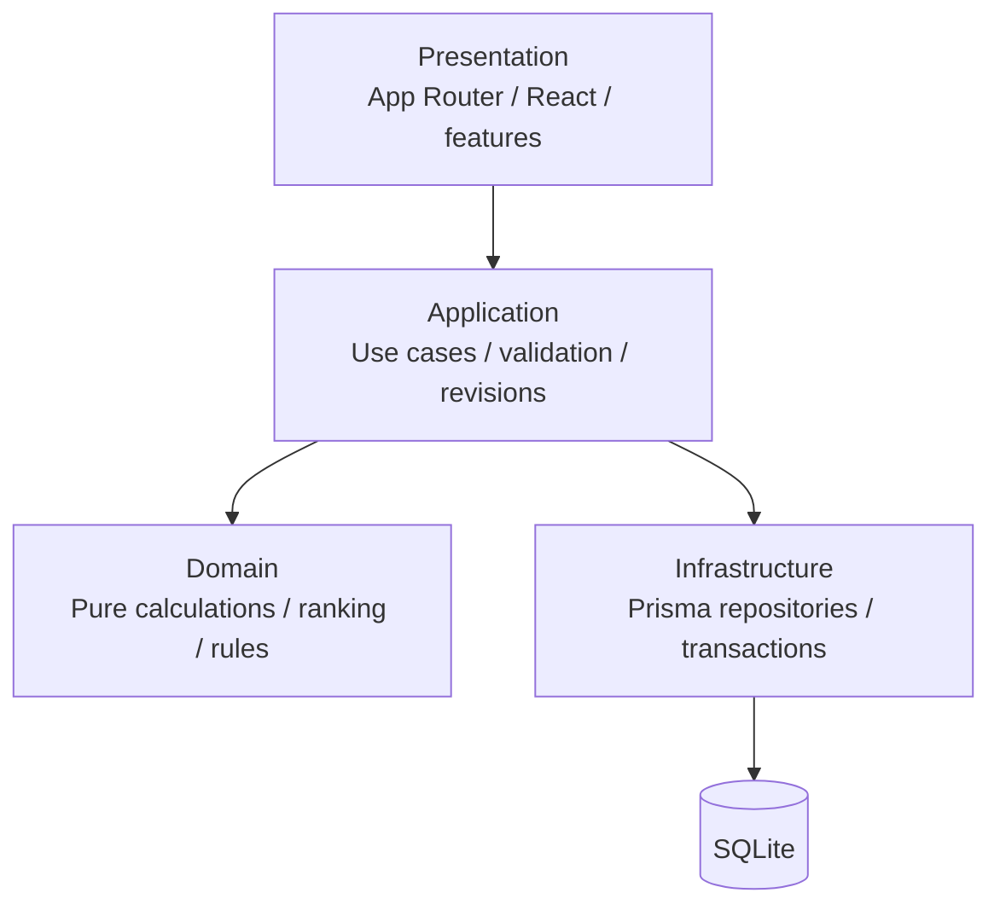

# 烛照AI投标助手架构

## 1. 状态与范围

本文档描述 **v0.1.0 MVP** 的实际架构。系统是一个 Next.js 单体全栈应用，覆盖项目管理、参数设置、候选单位、履约数据库、清标测算、定标预测、决策分析、分析报告和 Excel 预览导入。

当前数据库为 SQLite；应用通过 Prisma repository 隔离持久化细节，为后续迁移 PostgreSQL 保留边界。清标和定标规则均由纯 TypeScript domain 函数实现，React 组件不实现业务公式。

## 2. 技术决策

| 领域 | v0.1.0 决策 |
| --- | --- |
| 应用形态 | 单仓库、单进程、模块化单体 |
| Web | Next.js App Router、React、TypeScript strict |
| UI | Tailwind CSS、shadcn/ui、中文业务界面 |
| ORM / 数据库 | Prisma ORM / SQLite |
| 后续数据库 | PostgreSQL，通过 repository 边界迁移 |
| 十进制计算 | `decimal.js`；传输层使用十进制字符串 |
| 测试 | Vitest：domain、application、integration、关键流程 |
| 质量门禁 | ESLint、TypeScript、Vitest、Next.js build |
| 包管理器 | pnpm |

## 3. 分层



### 3.1 Presentation

- `src/app` 负责路由、Server Components、Server Actions 和 Route Handlers。
- `src/features` 负责表单、表格、Dialog、状态切换及页面级交互。
- `src/components` 提供布局、EmptyState、ErrorState、ConfirmDialog 和 shadcn/ui 基础组件。
- 展示层只执行格式化、输入单位转换和图表坐标计算，不计算业务分数、排名、基准价或模拟中标率。

### 3.2 Application

- `src/server/application` 负责加载一致输入、检查工作流前置条件、调用 domain、处理输入修订号并返回类型化 DTO。
- Server Action 保持轻量，只做请求校验、调用 application service、返回结构化结果和触发路由刷新。
- 清标、定标和 Excel 确认导入的数据库写入使用事务。

### 3.3 Domain

- `src/domain/performance`：最近 12 季度履约聚合。
- `src/domain/qingbiao`：参考报价、清标 K1、履约得分、报价排名、报价得分、总分和综合排名。
- `src/domain/dingbiao`：Top N、定标 K1、M 值、与 M 差额、预测中标单位和模拟中标率。
- `src/domain/analysis`：只基于保存结果生成决策派生数据和确定性文字总结。
- `src/domain/imports`：Excel 解析、字段映射、预览问题和规范化。

Domain 代码不依赖 React、Next.js、Prisma、数据库或浏览器 API。

### 3.4 Infrastructure

- `src/server/repositories` 实现 Prisma 查询与事务保存。
- `src/server/db/prisma.ts` 提供 Prisma Client 单例和 SQLite adapter。
- `prisma/schema.prisma` 是逻辑数据模型；`prisma/migrations` 是不可改写的数据库历史。
- `src/generated/prisma` 为生成文件，不承载手写业务规则。

## 4. 模块与路由

| 模块 | 主要路由 | 数据来源 |
| --- | --- | --- |
| 项目管理 | `/projects`、`/projects/new`、`/projects/[id]` | `Project` |
| 参数设置 | `/projects/[id]/settings` | `ProjectRule`、项目类型关联 |
| 候选单位 | `/projects/[id]/candidates` | `ProjectCandidate` |
| 履约数据库 | `/performance` | `CompanyPerformance` |
| 清标测算 | `/projects/[id]/qingbiao` | 清标 domain + 保存的清标场景/结果 |
| 定标预测 | `/projects/[id]/dingbiao` | 定标 domain + 保存的定标场景/结果 |
| 决策分析 | `/projects/[id]/analysis` | 只读保存的清标/定标结果 |
| 分析报告 | `/projects/[id]/report` | 保存结果的报告视图；正式导出未实现 |
| Excel 导入 | `/imports/excel` | 解析预览 + 确认后事务写入 |

我方单位只能通过 `ProjectCandidate.isOurCompany` 识别。任何公司名称都不能承担“我方”判断逻辑。

## 5. 核心数据模型

```text
Project
  ├─ ProjectRule
  │    └─ ProjectRuleProjectType
  ├─ ProjectCandidate
  ├─ QingbiaoExclusionRule × 4
  │    ├─ QingbiaoExclusionRuleCandidate
  │    └─ QingbiaoScenario × 4 K2
  │         ├─ QingbiaoResult
  │         └─ DingbiaoScenario × N × finalDrawIndex
  │              └─ DingbiaoResult
  └─ DingbiaoScenario

CompanyPerformance（跨项目公共数据）
```

v0.1.0 尚无独立 `Company` 表。`ProjectCandidate` 与 `CompanyPerformance` 由 application service 按规范化后的 `companyName` 和项目类型匹配；这是后续引入公司主数据 ID 时的迁移点。完整字段、关系和索引见 `docs/data-model.md`。

### 5.1 场景身份

清标场景身份固定为：

```text
QingbiaoScenarioIdentity =
exclusionRuleId + qingbiaoK2Value
```

定标场景身份固定为：

```text
DingbiaoScenarioIdentity =
sourceQingbiaoScenarioId + finalistCount + finalDrawIndex
```

`qingbiaoK2Value` 和 `finalDrawIndex` 都是离散槽位 identity。K2 rate 由唯一转换函数推导；`finalDrawValue` 是独立的 fraction 数值，不能代替 index 进入唯一键。

“全场景入围单位”保持 `scenarioId -> ordered QingbiaoResult Top5` 的二维结构，不按公司名称合并。Repository 提供按项目读取 4 条规则/16 个场景、按规则和 K2 定位场景、按场景读取有序结果，以及按 `sourceQingbiaoScenarioId` 读取定标结果的 API。

当前旧 4 场景页面只读取 `ruleIndex=1 + isLegacy=true` 的兼容数据。这个路径是 temporary/legacy，不赋予规则槽位1任何正式业务含义；新版清标页面上线时应移除。

## 6. 数据流与修订

### 6.1 读取

```text
Server Component → application query → Prisma repository → SQLite
                 ← decimal-string DTO ← persistence mapping ←
```

### 6.2 修改

```text
Client form → Server Action / Route Handler → Zod validation
            → application command → transaction / repository
            → input revision update → typed result → route refresh
```

### 6.3 测算

```text
前置条件检查 → 一致输入快照 → domain 纯函数 → 按场景身份事务保存
            → 结果 DTO → 页面展示与刷新恢复
```

- `qingbiaoInputRevision` 标识影响清标的输入版本。
- `dingbiaoInputRevision` 标识影响定标的输入版本。
- 场景保存 `inputRevision` 与 `ruleVersion`；不匹配当前输入时不作为有效下游数据。
- 当前旧清标兼容路径按 ruleIndex=1 的四个 K2 identity 覆盖结果；定标只替换同一个 `sourceQingbiaoScenarioId` 的 9 个结果，不再删除项目内其他来源。
- staged migration 保留无法推断规则归属的旧行，并以 nullable 新关系和 legacy 标记隔离，不提供用户可见的历史版本回滚。

## 7. 数值策略

- 金额、比例、分数、平均值和差额在数据库中使用 Prisma `Decimal`。
- Domain 使用 `decimal.js`，禁止使用 JavaScript 二进制浮点执行业务公式。
- Repository/Application/UI DTO 以十进制字符串传递，不把金额和比例序列化为 JSON number。
- 排名使用未舍入的计算值；格式化仅发生在展示层。
- 净下浮率、K1、定标抽值和模拟比例均保存/传输为 fraction，例如 10% 为 `0.10`。定标 M 的业务方向冲突仍待确认，见 `docs/calculation-rules.md`。

## 8. 业务计算隔离

| 业务结果 | 唯一实现位置 |
| --- | --- |
| 履约平均分 | `src/domain/performance/company-performance.ts` |
| 参考报价 B、清标 K1、履约得分、报价得分、总分 | `src/domain/qingbiao/calculator.ts` |
| 报价距离、报价排名、综合排名 | `src/domain/qingbiao/ranking.ts` |
| Top N、定标 K1、M 值、模拟中标率 | `src/domain/dingbiao/calculator.ts` |
| 与 M 差额、定标排名、预测中标单位 | `src/domain/dingbiao/ranking.ts` |
| 决策分析派生数据 | `src/domain/analysis/calculator.ts` |

React 页面不包含上述公式。表单中的 Decimal 运算只负责百分数与数据库小数比例之间的边界转换；排名图中的数值运算只负责 SVG 坐标。

## 9. 当前目录结构

```text
.
├── AGENTS.md
├── docs/
├── prisma/
│   ├── migrations/
│   ├── schema.prisma
│   └── seed.ts
├── scripts/
├── src/
│   ├── app/
│   │   ├── (dashboard)/
│   │   ├── api/imports/excel/
│   │   └── globals.css
│   ├── components/
│   │   ├── layout/
│   │   └── ui/
│   ├── domain/
│   │   ├── analysis/
│   │   ├── candidates/
│   │   ├── dingbiao/
│   │   ├── imports/
│   │   ├── performance/
│   │   ├── projects/
│   │   ├── qingbiao/
│   │   └── regression/
│   ├── features/
│   ├── generated/prisma/
│   ├── lib/
│   └── server/
│       ├── application/
│       ├── db/
│       ├── integration/
│       └── repositories/
├── .env.example
├── components.json
├── eslint.config.mjs
├── package.json
├── prisma.config.ts
├── tsconfig.json
└── vitest.config.ts
```

测试与实现共置；跨模块空库验收位于 `src/server/integration/mvp-acceptance.test.ts`。

## 10. 质量策略

### 10.1 Lint 与类型

- `pnpm lint` 执行 ESLint，`--max-warnings=0`。
- `pnpm typecheck` 执行 `tsc --noEmit`。
- TypeScript strict 开启；禁止 `any`、`ts-ignore`、`eslint-disable` 规避错误。
- 生产构建不忽略 ESLint 或类型错误。

### 10.2 测试

- Domain unit tests：公式、校验、边界值、并列排序和 Decimal 稳定性。
- Application tests：前置条件、修订冲突、事务编排和失败不落库。
- Integration tests：SQLite migration、Server Action/Route Handler、完整关键流程和刷新后持久化。
- Excel regression tests：解析器和原工作簿对照；差异不通过修改程序规则静默迎合。
- v0.1.0 尚未建立 Playwright 浏览器自动化，这是已知限制。

发布门禁固定为：

```powershell
pnpm lint
pnpm typecheck
pnpm test
pnpm build
```

## 11. PostgreSQL 迁移边界

- 保持 domain 的字符串 Decimal 契约不变。
- 用 PostgreSQL adapter 替换 SQLite adapter，并为金额、比例和分数设置明确精度。
- 重建 SQLite migration 中的部分唯一索引：每项目最多一个 `isOurCompany=true`，每定标场景最多一个 `isWinner=true`。
- 使用同一组 domain、integration 和黄金回归测试验证迁移结果。
- 不在 application service 中引入 SQLite 专属 SQL。

## 12. Step 5：新版清标端到端架构（2026-08-24）

`/projects/[id]/qingbiao` 已直接升级为新版页面，不另建 V2 路由。真实调用链为：

```text
Server Component
  -> getRuntimeQingbiaoPageData()
  -> QingbiaoManager（4 条规则配置、Rule -> K2 结果导航）
  -> Server Action
  -> calculateAllQingbiaoScenarios()
  -> calculateQingbiaoScenarioV2() × 16
  -> QingbiaoRepository.saveCalculationV2()（单个 Prisma transaction）
  -> 16 个场景、16 组完整排序、16 组有序 Top5
```

Application 固定并显式传入以下临时业务策略，不依赖 Domain 默认值：

```text
K1 candidate set = NON_EXCLUDED_CANDIDATES
ranking candidate set = ALL_CANDIDATES
```

四条规则的剔除关系分别通过 `QingbiaoExclusionRuleCandidate` 保存。每次变更只替换目标规则下的关联，并在同一事务内增加项目清标、定标输入修订号。计算保存前校验完整的 `4 × 4` 身份、规则当前剔除集合、全部排名候选及规则版本；任一校验或写入失败时整批回滚。

场景以 `(exclusionRuleId, qingbiaoK2)` upsert。重算先按具体 `scenarioId` 删除旧 `QingbiaoResult`，再写入该场景完整结果，既不会产生第 17 个场景，也不会触及其他项目。`getQingbiaoScenarioCatalog(projectId)` 返回 16 项带 `scenarioId` 和每项 `finalRank` 的 Top5，作为 Step 6 定标来源选择的正式接口。

页面用 `QingbiaoScenario.inputRevision` 与 `Project.qingbiaoInputRevision` 区分“尚未计算 / 当前有效 / 已过期”。规则、项目参数和候选单位写入已接入修订号；公共 `CompanyPerformance` 的新增或修改尚不能反向定位所有受影响项目，因此履约变化导致的自动失效仍是后续一致性工作。

新版清标、定标和 analysis 已不再假设项目只有 4 个 K2 场景。底层 `isLegacy` 标记仅用于保留历史兼容数据；当前定标目录和全场景 analysis 都按明确的 `sourceQingbiaoScenarioId`、规则版本与输入修订读取，不按 `ruleIndex=1` 或 `isLegacy=true` 筛选，也不赋予规则 1 特殊业务含义。

## 13. 暂缓事项

- 定标比例单位与 M 公式的最终业务口径。
- 最近 12 季度的正式加权规则。
- 正式分析报告导出和版本历史。
- 用户认证、权限和审计。
- PostgreSQL 生产部署、备份恢复和浏览器端自动化。

## 14. Step 7：全量定标与派生决策分析（2026-08-24）

全场景 Application 入口以当前 16 个清标来源为输入，复用既有 `calculateDingbiaoSimulation()` 和定标 repository 保存入口，形成理论最多 `16×3×3=144` 个定标场景。批处理先在短事务中仅清除本项目当前 16 个来源的旧结果，再逐来源使用短事务保存最多 9 个场景；重跑不会追加第 145 条，也不会删除其他项目或非目标来源。

`src/server/repositories/analysis-repository.ts` 读取 current 的清标/定标结果，按项目修订、规则版本和来源修订过滤旧结果。`src/domain/analysis/calculator.ts` 只执行计数、分组、平均排名和稳定排序，不调用或复制 K1、B、M、差值、排名、winner 公式。统一的 `ScenarioAnalysisRecord` 保留 rule、K2、N、抽值、来源、胜出单位、我方排名/差值、M、K1 和保存时间。

分析结果同时暴露固定 `theoreticalScenarioCount=144` 与实际 `validScenarioCount`。一个清标来源只有 4 家时仅有 N=4/3 的 6 个结果，项目实际分母为 141；所有胜出率均展示 `wins/valid`。未设置我方单位不会阻断胜出单位分布和明细，也不会显示伪造的 0% 我方胜出率。

当前分析是保存结果的派生视图，没有新增 analysis batch 表或 Prisma migration。版本完整性由 current input revision、Qingbiao/Dingbiao rule version、source revision、一次运行共享的 `calculatedAt`、稳定来源 ID 和批量重算前清理共同保证。未来若需要保留多批历史、运行恢复或并发批次仲裁，再引入显式 `GlobalAnalysisRun`。详细流程见 `docs/global-analysis-flow.md`。
