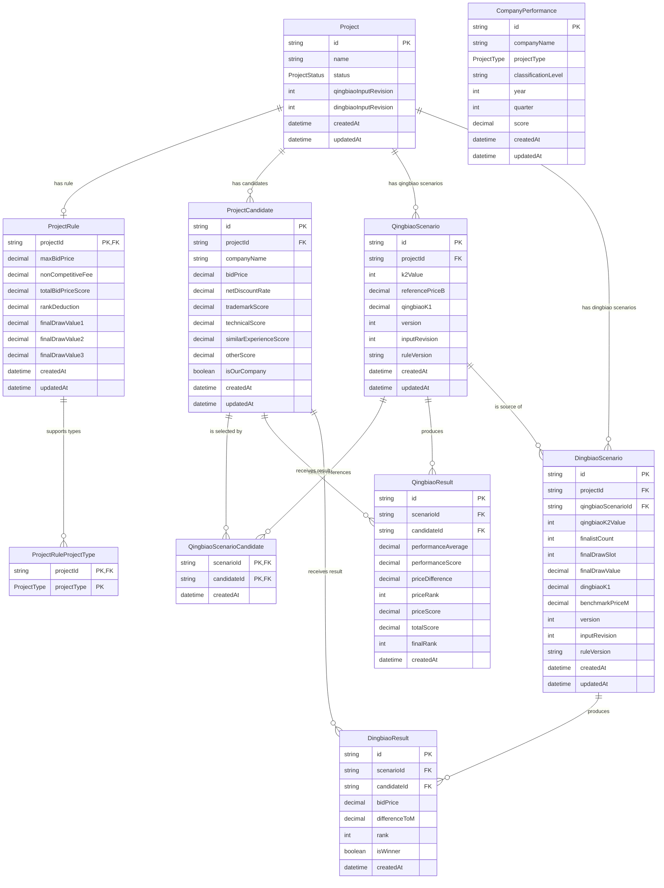

# 烛照AI投标助手数据模型

## 1. 范围

本文档描述 MVP 阶段 Prisma + SQLite 数据模型。模型负责保存项目输入、公共履约记录、清标/定标场景及结果快照；本阶段不实现清标或定标算法。

数据库文件由 `DATABASE_URL` 指定，本地默认值为 `file:./dev.db`。数据库文件不提交到版本库。

## 2. ER 图

`ProjectRuleProjectType` 和 `QingbiaoScenarioCandidate` 是为多选关系增加的显式关联实体。



`CompanyPerformance` 是跨项目公共数据，目前按 `companyName + projectType` 关联业务。后续引入独立 Company 主数据时，应增加 `companyId` 并迁移名称关联，避免公司更名导致匹配失败。

## 3. 枚举

### ProjectStatus

- `DRAFT`
- `CALCULATED`
- `COMPLETED`

### ProjectType

- `CURTAIN_WALL`
- `DECORATION`
- `GENERAL_CONTRACT`
- `LABORATORY`

SQLite 将 Prisma 枚举保存为文本，因此初始迁移同时建立数据库 `CHECK` 约束。迁移到 PostgreSQL 时可以改用原生 enum 或受控文本类型。

## 4. 多选项目类型

SQLite 不支持 Prisma scalar list。项目类型使用显式关联表 `ProjectRuleProjectType`：

```text
ProjectRule 1 ─── N ProjectRuleProjectType
```

复合主键 `(projectId, projectType)` 防止同一项目规则重复选择专业，并方便以后在 PostgreSQL 中保持规范化结构。

## 5. 清标参考单位关系

`QingbiaoScenarioCandidate` 保存每个清标场景选择了哪些候选单位用于参考数据：

```text
QingbiaoScenario N ─── M ProjectCandidate
```

复合主键 `(scenarioId, candidateId)` 防止同一候选单位在一个场景中被重复选择。

应用服务在写入时还必须验证候选单位和场景属于同一个 Project。该跨聚合约束不放入 UI，也不通过名称匹配实现。

## 6. 唯一约束与索引

主要唯一约束：

| 模型 | 约束 | 目的 |
|---|---|---|
| ProjectRule | `projectId` 主键 | 一个项目最多一套规则 |
| ProjectRuleProjectType | `(projectId, projectType)` | 项目专业不重复 |
| ProjectCandidate | `(projectId, companyName)` | 项目内单位不重复 |
| CompanyPerformance | `(companyName, projectType, year, quarter)` | 同一季度履约记录唯一 |
| QingbiaoScenario | `(projectId, k2Value, version)` | 场景版本唯一 |
| QingbiaoScenarioCandidate | `(scenarioId, candidateId)` | 场景选择不重复 |
| QingbiaoResult | `(scenarioId, candidateId)` | 单位在场景中只有一条结果 |
| DingbiaoScenario | `(projectId, qingbiaoK2Value, finalistCount, finalDrawSlot, version)` | 抽值1/2/3在定标情景版本内唯一，即使抽值数值相同也可独立保存 |
| DingbiaoResult | `(scenarioId, candidateId)` | 单位在定标情景中只有一条结果 |

初始迁移包含两个部分唯一索引：

- `ProjectCandidate_one_our_company_per_project`：一个 Project 最多一个 `isOurCompany=true`。
- `DingbiaoResult_one_winner_per_scenario`：一个确定的定标场景最多一个 `isWinner=true`。

这类部分索引暂时不能完整表达在 Prisma schema 中，因此保存在 migration SQL，并需要在 PostgreSQL 迁移时用对应语法重建。

查询索引覆盖：

- 项目状态和创建时间。
- 项目候选单位及公司名称。
- 公司、专业、年度和季度履约查询。
- 清标/定标场景按项目和创建时间查询。
- 清标最终排名、报价排名及定标排名。

## 7. 数据检查约束

初始 SQLite migration 使用 `CHECK` 约束保护：

- ProjectStatus 和 ProjectType 枚举值。
- `k2Value`、`qingbiaoK2Value` 只能为 0、1、2、3。
- `finalistCount` 只能为 3、4、5。
- `quarter` 只能为 1、2、3、4。
- 金额、得分、差额和排名的基础非负/正数要求。
- 净下浮率当前限定为 0 至 1 的小数比例。
- 不可竞争费非负且小于最高投标限价。

服务端仍必须执行同样的业务校验，数据库约束是最后一道保护，不替代应用错误提示。

## 8. Decimal 策略

所有金额、百分比、得分和计算中间值使用 Prisma `Decimal`，不使用 Prisma `Float`。

规则：

- seed 和 API 边界使用十进制字符串，例如 `"8600.00"`。
- 比例按小数保存，例如 1%保存为 `"0.01"`。
- React 和 JSON DTO 不接收数据库 Decimal 实例，统一转换为十进制字符串。
- 后续 domain 计算使用独立高精度十进制类型，不使用 JavaScript `number` 执行业务公式。
- 排名使用未舍入值，展示层才格式化。

SQLite 的类型约束弱于 PostgreSQL，因此包含 Decimal 往返验证。迁移 PostgreSQL 时应根据业务最大金额和精度增加明确的 `Decimal(precision, scale)` 原生类型。

## 9. 版本与结果追溯

场景额外保存：

- `version`
- `inputRevision`
- `ruleVersion`

它们用于把结果绑定到确定的输入和规则版本。上游数据变化时，旧结果可以保留用于报告追溯，但不能继续作为有效下游输入。

`DingbiaoScenario.qingbiaoScenarioId` 指向实际使用的清标场景版本，而 `qingbiaoK2Value`保留为结果快照字段。

## 10. Seed 数据

`prisma/seed.ts` 是幂等 seed，包含：

- 1个测试项目：`project-001`。
- 1套项目规则及2个项目类型。
- 6个候选单位，其中1个标记为我方单位。
- 20条季度履约记录，覆盖幕墙、装修、总包和实验室专业。

seed 不创建清标或定标结果，避免在算法未确认时写入伪造计算数据。

## 11. 常用命令

```bash
npm run db:generate
npm run db:migrate
npm run db:seed
npm run db:verify
npm run db:studio
```

迁移文件位于 `prisma/migrations`，已经应用的 migration 不得修改。
