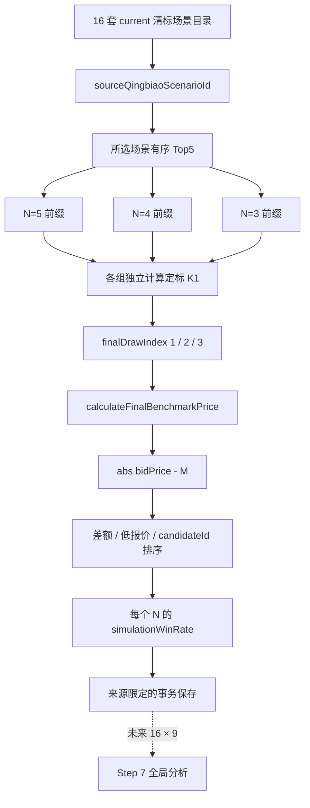

# 定标流程（20260820 / Step 6）

## 1. 实施范围

Step 6 升级既有定标 Domain、Application、Repository 和 `/projects/[id]/dingbiao` 页面。一次操作只计算用户选择的一套清标来源，最多生成 9 套定标场景；不会自动遍历 16 套清标来源，也不会生成 `16 × 9 = 144` 套全局分析数据。

正式规则版本为 `dingbiao-20260820-v2`。本步骤复用 Step 3 已有的 Prisma 字段与唯一键，没有修改 schema 或 migration，也没有建立长期并存的第二套定标模型。

## 2. 数据流



## 3. 清标来源选择

页面选项来自 `getQingbiaoScenarioCatalog(projectId)`。current 目录正常包含 16 项，每项提供：

- `scenarioId`；
- `exclusionRuleId / ruleIndex`；
- `qingbiaoK2Value`；
- `qingbiaoK1Fraction`；
- `referencePriceB`；
- 保持 `finalRank` 顺序的 Top5 摘要。

用户提交的是 `sourceQingbiaoScenarioId`。同一个 K2 对应四条不同推优规则，K2 只用于显示和数据库兼容，不能作为定标正式来源身份。页面以“规则 X · K2=Y%”显示 16 个选项，并展示所选来源的清标 K1、B 和 Top5。

下列来源不能进入正式定标：

- ID 不存在或不属于当前项目；
- 没有清标排名结果；
- 清标目录 stale；
- 不是 `qingbiao-20260820-v2` 的可追溯场景，或没有显式推优规则来源；
- 项目/清标输入修订在计算到保存之间发生变化。

页面对 stale 结果提示：“当前清标结果已过期，请重新完成清标测算后再进行定标。”旧 Top5 不会继续参与计算。

## 4. Top N 与定标 K1

来源 `QingbiaoResult` 只按 `finalRank ASC` 读取。三组候选必须是同一有序序列的前缀：

```text
N=5 = rank 1..5
N=4 = rank 1..4
N=3 = rank 1..3
```

用户不能重录单位或改变顺序。若来源只有 4 家，N=5 返回 `insufficient_candidates`，N=4 和 N=3 仍可计算；绝不制造第 5 家。

每个可用 N 独立计算：

```text
dingbiaoK1Fraction = sum(TopN.netDiscountRateFraction) / N
```

定标 K1 直接平均原始 fraction，不使用清标 K1，也不执行 round 或 unique。某个 Top N 中任一单位缺失或包含超出 `[0,1]` 的净下浮率时，该 N 返回 `invalid_net_discount_rate` 结构化状态，不把缺失值当 0。

## 5. 三个抽值和九套身份

三个抽值来自 `ProjectRule.finalDrawValue1/2/3`，数据库和 Domain 都使用 fraction：

```text
1% = 0.01
10% = 0.10
```

抽值槽位身份是 `finalDrawIndex=1/2/3`，不是抽值数值。即使抽值 1 和抽值 2 都为 `0.01`，它们仍是两套独立场景。

正常 Top5 产生：

```text
N=5 × draw index 1/2/3 = 3
N=4 × draw index 1/2/3 = 3
N=3 × draw index 1/2/3 = 3
总计 9 套
```

数据库唯一身份为：

```text
sourceQingbiaoScenarioId
+ finalistCount
+ finalDrawIndex
```

## 6. M、差额和 winner

所有 N 调用同一个 `calculateFinalBenchmarkPrice()`：

```text
M = (1 - dingbiaoK1Fraction - finalDrawValueFraction)
    × (maxBidPrice - nonCompetitiveFee)
    + nonCompetitiveFee
```

最新版 Excel 的 N=4/N=3 旧加法文字按模板复制错误处理，N=5/N=4/N=3 正式统一为补数公式。核心金额和比例计算全程使用 `decimal.js`。当：

```text
1 - dingbiaoK1Fraction - finalDrawValueFraction <= 0
```

Domain 返回 `NON_POSITIVE_BENCHMARK_FACTOR`，不生成负数或异常 M。

对当前 Top N 的每家单位：

```text
differenceToM = abs(bidPrice - M)
```

winner 排序规则为：

1. `differenceToM` 升序；
2. `bidPrice` 升序；
3. `candidateId` 升序。

第一名唯一标记 `isWinner=true`。

## 7. 快照与模拟中标率

每条 `DingbiaoResult` 保存：

- `candidateId`；
- `bidPrice`；
- `netDiscountRateSnapshot`；
- `sourceQingbiaoRank`；
- `differenceToM`；
- 定标 `rank`；
- `isWinner`。

因此候选单位的实时报价或净下浮率以后发生变化，保存结果仍能解释当时的来源、M 差额和 winner。

同一 N 的模拟中标率为：

```text
simulationWinRate = 我方在三个 draw 场景的中标次数 / 3
```

Domain 返回 fraction：`3/3=1`、`2/3≈0.6667`。UI 才格式化为 `100%`、`66.67%`。没有设置我方单位时，定标和 winner 仍照常计算；页面显示“未设置我方单位”，不把 0% 当成有效的我方模拟结论。

## 8. 事务、重算与刷新

Application 统一入口是：

```text
calculateDingbiaoForQingbiaoScenario(
  projectId,
  sourceQingbiaoScenarioId
)
```

保存事务重新核对项目定标修订、清标修订、来源规则版本、Top N 候选集合与报价/净下浮率/来源排名快照。任一冲突都不写入部分结果。

重算来源 A 时，Repository 只删除 `sourceQingbiaoScenarioId=A` 的旧场景并写回最多 9 条；来源 B 不受影响。相同来源重复计算不会产生第 10 条。清标重算某一来源时，在替换其清标结果前删除该来源派生的旧定标结果，避免旧 Top5 定标继续被误认为 current。

页面刷新后从持久化层恢复最近一次计算的来源 ID、规则/K2、最多 9 套场景、结果快照和每个 N 的模拟中标率，不依赖 React state。

## 9. Golden Fixture

人工可核验 fixture 使用：

```text
H = 1000
C = 100
draw = 0 / 0.01 / 0.02
Top5 rates = 0.08 / 0.09 / 0.10 / 0.11 / 0.12
```

关键结果：

| N | 定标 K1 | M1 / M2 / M3 | winner 1 / 2 / 3 | 我方模拟中标率 |
| --- | --- | --- | --- | --- |
| 5 | 0.10 | 910 / 901 / 892 | c1 / c1 / c5 | 2/3 |
| 4 | 0.095 | 914.5 / 905.5 / 896.5 | c2 / c1 / c3 | 1/3 |
| 3 | 0.09 | 919 / 910 / 901 | c2 / c1 / c1 | 2/3 |

该 fixture 同时验证 Top N 顺序、三个独立 K1、九套抽值身份、新 M 公式、差额、winner 和 fraction 中标率。

## 10. Step 7 边界

当前数据模型和 source-scoped 保存已经允许同一项目并存不同清标来源的定标结果，但 UI 一次只主动计算一套来源。Step 7 在业务确认全局聚合分母、最佳场景并列规则和报告维度后，才能实现 `16 × 9 = 144` 全场景分析。Step 6 不自动计算 144 套。
