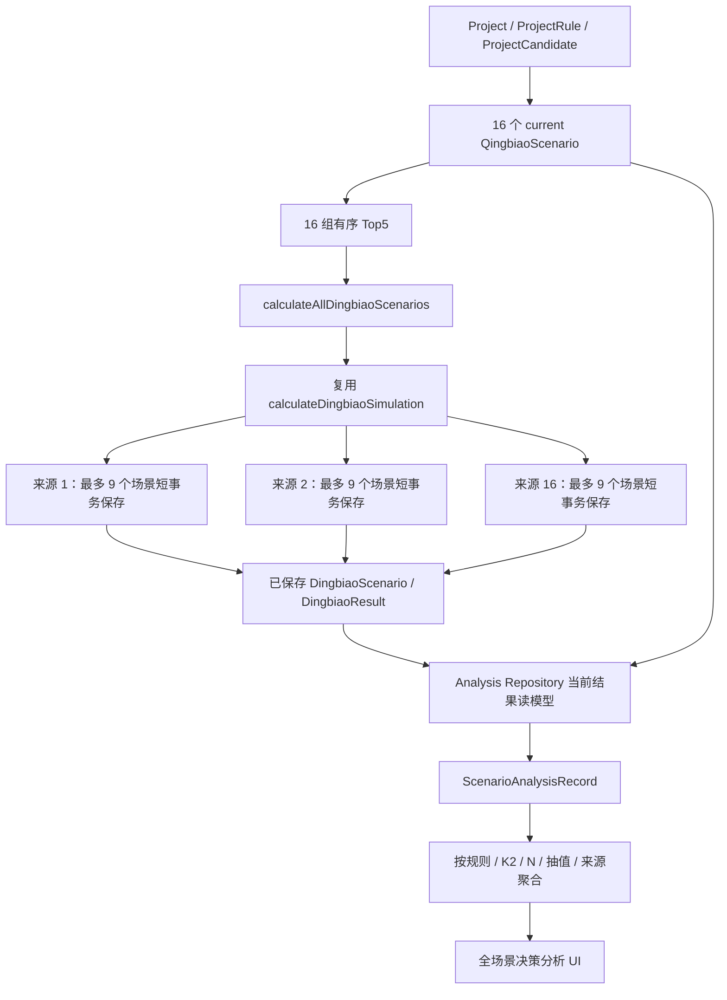

# 全场景定标与决策分析流程

## 1. 范围与原则

本文件记录 Step 7（2026-08-24）已经落地的全量定标批处理和派生决策分析。理论场景宇宙为：

```text
4 种推优剔除规则
× 4 种清标 K2（0% / 1% / 2% / 3%）
× 3 种入围单位数 N（5 / 4 / 3）
× 3 个定标抽值序号（1 / 2 / 3）
= 144 个定标场景
```

本步骤没有修改 Prisma schema、清标公式、定标公式、percentage fraction 合同、履约权重或业务规则含义。分析层只读取已保存的清标和定标结果，不重新计算 K1、B、M、差值、排名或胜出单位，也不为任何场景赋予概率或权重。

## 2. 端到端数据流



## 3. 批量计算入口

Application 入口为 `calculateAllDingbiaoScenarios(projectId)`；运行时入口为 `calculateAllRuntimeDingbiaoScenarios(projectId)`。它执行以下前置校验：

1. 项目、参数规则、候选单位和三个定标抽值可读取；
2. 清标目录必须是 current；
3. 必须恰好具备规则 1～4 × K2 0～3 的 16 个唯一来源；
4. 每个来源必须具备保存的有序清标结果；
5. 项目清标/定标输入修订号在清理和保存时必须仍与预读快照一致。

不足 16 套时批量入口直接阻止执行，并返回实际 `X/16`。stale 清标结果不能作为定标来源。

批处理先为 16 个来源调用既有 `calculateDingbiaoSimulation()`，只提取 Domain 已判定为 available 的 N 组。随后在一个短事务内仅清除本项目当前 16 个来源的旧定标结果，再逐来源使用既有 repository 保存入口，每个来源一个短事务、最多 9 个场景。它不会删除其他项目，也不会删除本项目非目标来源。

因此重跑是“替换当前 16 个来源”，正常结果始终为 144，而不是追加为 288 或产生第 145 条。若某来源保存失败，其他来源继续；返回 `partial_failure`、实际有效数和逐来源错误，不会对用户宣称全部成功。清理在写入前完成，避免失败来源遗留上次结果而被误认为本批次结果。

## 4. 理论场景数与有效场景数

- `theoreticalScenarioCount` 固定为 144，表达完整业务笛卡尔积的理论上限；
- `validScenarioCount` 只统计当前修订、当前规则版本、当前清标来源下实际保存且结构有效的定标场景；
- 一个来源 Top5 完整时通常生成 9 个有效场景；
- 一个来源只有 4 家时只支持 N=4/3，生成 6 个，有效总数为 `15×9+6=141`；
- 页面和所有胜出率始终显示分子与实际有效分母，不使用 144 替代有效分母。

## 5. 分析统一读模型

每个保存的有效定标场景映射成一条 `ScenarioAnalysisRecord`，包含：

- `projectId`、`dingbiaoScenarioId`、`sourceQingbiaoScenarioId`；
- `exclusionRuleId`、`ruleIndex`、`qingbiaoK2Value`；
- `finalistCount`、`finalDrawIndex`、`finalDrawValueFraction`；
- 胜出单位 ID、名称、是否我方、清标来源排名和定标排名；
- `ourCompanyCandidateId`、`ourCompanyQingbiaoRank`、`ourCompanyDingbiaoRank`、`ourCompanyDifferenceToM`；
- 已保存的 `benchmarkPriceM`、`dingbiaoK1Fraction`、`calculatedAt`；
- `isValid`。

Repository 只纳入：

- `QingbiaoScenario.ruleVersion = qingbiao-20260820-v1`；
- `DingbiaoScenario.ruleVersion = dingbiao-20260820-v2`；
- 清标和定标 `inputRevision` 与项目当前修订一致；
- 定标来源的清标修订与项目当前清标修订一致；
- 来源属于当前项目且具有明确推优规则；
- N、抽值序号、候选数和唯一胜出单位结构有效。

旧 4 场景兼容行、stale 结果、其他项目结果和来源不明的历史结果不进入当前全局分析。

## 6. 派生统计口径

### 6.1 我方全局模拟胜出率

```text
ourWinCount / validScenarioCount
```

这是已保存场景的等权频数统计，不是概率预测。页面始终显示 `wins / valid` 和百分比。项目未设置我方单位时，胜出率显示“未设置我方单位”，而不是 0%；定标胜出单位分布、清标 Top1 频次、竞争对手统计和场景明细仍然可用。

### 6.2 分维度统计

按以下维度分别统计有效场景数、我方胜出数和胜出率：

- 推优剔除规则 1～4；
- 清标 K2 0%～3%；
- N=5/4/3；
- 定标抽值序号 1/2/3。

规则维度另统计我方清标排名的最佳、最差和平均值。缺失排名不进入排名统计。

### 6.3 16 来源矩阵与来源 × N 矩阵

每个“规则 × K2”来源展示：有序 Top5、我方清标排名、该来源下 `wins / valid` 和胜出率。来源 × N 矩阵进一步展示每个来源在 N=5/4/3 下的 `wins / valid`；完整来源中每个 N 的有效分母通常为 3。

### 6.4 胜出单位和主要竞争对手

每个单位统计 `winnerCount / validScenarioCount` 和 win share，按胜出次数降序、candidateId 升序稳定排序。主要竞争对手为胜出次数最高的前三个非我方单位；此排序不代表概率或推荐权重。

### 6.5 清标稳定性

针对我方单位，统计 Top1、Top3、Top4、Top5 出现次数与当前参与清标来源数，并计算最佳、最差和平均清标排名。排名聚合只使用实际出现的排名；覆盖率分母使用当前参与来源数。

### 6.6 最佳与最差清标来源

最佳来源排序：

1. 我方胜出率降序；
2. 我方清标排名升序；
3. `ruleIndex` 升序；
4. 清标 K2 升序。

最差来源先按我方胜出率升序，再以较差清标排名优先，最后按 `ruleIndex`、K2 升序稳定排序。只比较至少有一个有效定标场景的来源。未设置我方单位时不计算最佳/最差来源。

## 7. 页面状态与重算一致性

`/projects/[id]/analysis` 区分清标和定标的 `not_calculated / incomplete / stale / current`：

- 清标必须 current 且达到 16/16 才允许点击“运行全场景分析”；
- 定标不完整时仍展示已有来源和实际有效结果，不把部分批次冒充完整批次；一次全量运行给所有来源写入同一个 `calculatedAt`，即使 revision 相同，不同批次时间的来源也不能拼成 current 全批次；
- 参数、候选单位或来源修订冲突时批处理返回 conflict；
- 清标重算会删除对应来源的旧定标派生结果；
- 全量定标重跑先清除当前 16 来源，随后逐来源重建，避免新旧批次混合；
- 当前 schema 不保存历史 analysis batch，分析是 current 结果的派生视图。

分析页包含核心指标、清标稳定性、16 来源矩阵、来源 × N、规则/K2/N/抽值聚合、胜出单位/主要竞争对手，以及可按规则、K2、N、抽值、胜出单位和我方/非我方胜出筛选的全场景明细。

## 8. 持久化边界与后续演进

本步骤复用现有 `QingbiaoScenario`、`DingbiaoScenario` 和 `DingbiaoResult`，没有新增批次表。当前模型依靠稳定来源 ID、唯一键、input revision、rule version、来源 revision 和保存时间识别 current 结果，足以支持当前单一 current 结果集。

如果未来要求保存多次全场景运行历史、回滚、审计某次批量任务、运行进度恢复或并发批次仲裁，应再引入 `GlobalAnalysisRun` / `DingbiaoCalculationBatch`，把 16 个 source run 关联到同一不可变批次。当前不应从 144 条结果反向伪造历史批次。

## 9. 验证入口

```powershell
pnpm test -- src/domain/analysis/calculator.test.ts
pnpm test -- src/server/application/global-dingbiao-service.test.ts
pnpm test -- src/server/repositories/scenario-structure-repository.test.ts
pnpm verify:global-analysis
```

数据库集成测试覆盖正常 144、重跑仍为 144、其他项目不受影响，以及一个来源仅 4 家时的 141/144。专项脚本创建临时验收项目，完成清标 16 来源、两次全量定标和派生分析读取，最后清理验收数据。
