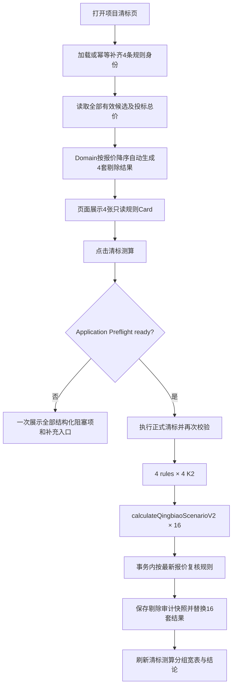

# 清标 Web 流程

本文档记录 2026-08-28 起生效的清标 Application / Repository / UI 契约。路由为 `/projects/[id]/qingbiao`，正式规则版本为 `qingbiao-20260828-auto-high-bid-v3`。

## 1. 用户流程



用户只维护候选单位及其投标总价，不生成、确认或保存推优剔除规则，也不能提交 `excludedCandidateIds`。

## 2. 自动推优剔除

唯一规则入口是 Domain 纯函数 `calculateAutomaticExclusionRules(candidates)`。它使用 Decimal 比较报价，按 `bidPrice DESC, candidateId ASC` 排序，并返回每条规则的候选总数、剔除数量和候选 ID。完整公式见 [qingbiao-exclusion-rules.md](./qingbiao-exclusion-rules.md)。

页面只读展示：

- 规则1：最高报价 1 家；
- 规则2：最高报价前 2 家；
- 规则3：`max(1, ROUND_HALF_UP(n / 3))` 家；
- 规则4：`max(1, ROUND_HALF_UP(n / 4))` 家。

“随机剔除”仅是沿用业务文案，不使用随机数、shuffle 或抽样。

## 3. Qingbiao Preflight / Readiness

按钮仅在请求执行期间禁用。即使前置条件不满足，用户仍可点击“清标测算”；Application 的 `getQingbiaoReadiness(projectId)` 会一次收集全部可确定问题，返回 `code / category / title / message / actionLabel / actionHref`，页面打开“暂不能进行清标测算”Dialog。阻塞项可直接跳转参数设置、候选单位或履约信息。

Readiness 与正式计算共同覆盖：

- 项目存在、项目类型和价格范围有效；
- 总投标报价分值、排名递减扣分值有效；
- 候选单位存在，单位名称、投标总价、净下浮率及分值有效；
- 4 套自动剔除结果均有效；
- 每条规则执行后至少剩 1 个 K1 候选；
- 按当前 `projectId + candidateId + projectType` 检查履约明细；
- 单位履约加权分快照已保存、未 stale，且每个候选/项目类型有有效加权值。

候选不足时 Domain/Application 返回 `QINGBIAO_INSUFFICIENT_CANDIDATES_FOR_EXCLUSION` 对应的中文问题。例如两家候选执行规则2时，不会把剔除数量静默缩减为 1。

UI 不再自行拼接另一套 `canCalculate` 规则，也不存在 `if (!canCalculate) return`。点击 handler 先显式设置 `isPending=true`，再调用当前计算 Action；计算 Action 返回明确的成功或失败 code/message。无论成功、业务校验失败还是异常，`finally` 都释放防重复锁并恢复按钮。成功后执行 `router.refresh()` 并提示“清标测算完成，共生成16套清标场景。”。

开发环境额外记录 `QINGBIAO_CLICK`、`QINGBIAO_ACTION_START`、`QINGBIAO_SERVICE_START` 与 `QINGBIAO_SERVICE_COMPLETE`，仅含项目标识、状态和场景数。工作站通过 `192.168.114.168` 访问本地开发服务时，该精确主机仅在 `NODE_ENV=development` 下列入 Next.js `allowedDevOrigins`；生产构建不注入该配置，也未允许通配 Origin/Host。否则开发服务器会返回服务端 HTML、却阻止客户端 chunks，导致 React 未 hydration，按钮呈现为可点击但没有任何事件。

`pnpm test:e2e:lan:smoke` 会完整重启绑定 `0.0.0.0:3000` 的隔离开发服务，并从 `http://192.168.114.168:3000` 验证 hydration、点击 trace、Server Action POST、loading、成功提示、清标表与清标结论。`pnpm test:e2e:lan` 在同一 LAN Origin 下执行完整浏览器套件，覆盖参数、候选、履约、清标、定标、分析与导出等关键 Client Components。

## 4. Application 与 Domain 契约

`calculateAllQingbiaoScenarios(projectId)` 先按最新候选报价取得自动剔除结果，再针对每个 `ruleIndex=1..4` 与 `qingbiaoK2Value=0..3` 调用 `calculateQingbiaoScenarioV2()`。

```text
K1 candidates = NON_EXCLUDED_CANDIDATES
Ranking candidates = ALL_CANDIDATES
```

自动剔除单位不进入该规则 K1 样本，但仍参与报价排名、综合评分、最终排名和 Top5。K1 继续执行既有“fraction × 100 → HALF_UP 整数百分点 → unique → average → ÷ 100”逻辑；B、Price Score、定标 M 和 Analysis 公式均未因本次规则修正而改变。

## 5. 事务、审计快照与重算

`saveCalculationV2()` 在同一事务内：

1. 重读项目修订、候选 ID 和 Decimal 报价；
2. 重新运行自动剔除 Domain 规则，拒绝客户端或并发产生的不一致集合；
3. 将 `QingbiaoExclusionRuleCandidate` 替换为本批测算的系统判定审计快照；
4. 按 `(exclusionRuleId, qingbiaoK2)` upsert 16 个场景；
5. 替换每个场景的全部 `QingbiaoResult`；
6. 保存相同的 `inputRevision` 和 `qingbiao-20260828-auto-high-bid-v3`。

`QingbiaoExclusionRuleCandidate` 不再表示用户配置，且没有公开 Action/Repository 写入口供 UI 修改。重算复用稳定场景身份，并更新规则审计快照。

旧规则版本（例如 `qingbiao-20260820-v2`）的16条记录不会被伪装成当前结果；页面状态为 `not_calculated`。用户点击“清标测算”后，事务按稳定场景唯一键原位更新为当前规则版本、替换审计快照和结果，不新增为32条。

## 6. stale / revision

投标总价是自动剔除规则的正式输入。候选新增、删除或任一候选字段（包括 `bidPrice`）实际变化时，现有候选仓储会递增 `qingbiaoInputRevision` 与 `dingbiaoInputRevision`：

- 旧清标结果变为 `stale`；
- 依赖旧清标来源的定标和 Analysis 不再视为 current；
- 再次进入清标页时，4 张只读 Card 已按最新报价重新派生；
- 重新测算后仍生成 16 套场景。

结果状态：

- `not_calculated`：没有完整的 16 条当前规则版本场景；
- `current`：16 条结果修订与项目当前输入修订一致；
- `stale`：存在历史结果，但输入修订已变化。

开发环境按阶段输出结构化事件：`QINGBIAO_START`、`QINGBIAO_PREFLIGHT_PASS`、4条 `QINGBIAO_RULE_n_GENERATED`、16次 `QINGBIAO_SCENARIO_CALCULATED`、`QINGBIAO_PERSIST_START`、`QINGBIAO_PERSIST_COMPLETE`、`QINGBIAO_DONE`。日志只包含项目标识、数量、规则索引和K2，不输出单位名称、报价或履约分。`pnpm diagnose:qingbiao` 可只读检查本地项目的 readiness、版本、场景/结果数量与ViewModel读取状态。

## 7. 结果宽表与场景目录

结果区域使用“清标测算表”只读 ViewModel，一次读取16套场景，不在 React 中重新计算 K1、B、差值、排序或分数。顶部含规则说明入口和4个规则 pill；规则切换联动自动剔除说明、当前 K1、4个K2综合得分及4组场景明细。

宽表使用两级表头：左侧基础字段、`清标 K2 对应总分(0/1/2/3%)`，以及4组`假如抽中 X%`，每组读取已保存的 `B值 / 差值 / 排序 / 分数`。外层支持横向滚动，序号、单位、投标总价和净下浮率为 sticky 列。履约加权分快照缺失或 stale 时显示红色告警，当前履约值显示“—”，避免把旧快照当成 current。

宽表下方的“清标测算结论”使用独立只读 ViewModel，按规则1至4、每条规则 K2=0/1/2/3 的固定顺序直接映射16个场景的已保存 `Top5`，不在 React 中按分数重排。候选不足5家时展示实际数量；我方单位使用红色加粗。底部“全场景入围单位”按同一遍历顺序以 `candidateId` 首次出现去重。`not_calculated` 显示空状态；`stale` 只显示过期提示，不渲染旧结论。

每个持久化目录项继续保留：

```text
scenarioId + exclusionRuleId + ruleIndex + qingbiaoK2Value
+ qingbiaoK1Fraction + referencePriceB + ordered Top5
```

全场景入围单位不是公司名称并集；同一候选出现在多个场景时，必须保留每个场景独立的来源身份与 `finalRank`。

## 8. 广田全场景入围保障测算

清标测算结论下方增加独立只读模块。它仅在存在唯一我方单位、16套 current Qingbiao 场景、完整候选评分、current 履约加权分快照和4条自动推优规则时输出结果；缺失我方、未清标、stale、履约不可用或计算失败均显示明确中文状态。

Application 只负责前置条件和 ViewModel 编排，实际反向扫描位于 `src/domain/qingbiao-reverse-simulation`。扫描时固定所有竞争对手输入以及我方履约、同类业绩、其他主客观分、商务优和技术优，仅改变我方净下浮率与按正式关系换算的投标总价。每个采样点重新生成自动剔除集合并调用正式 Qingbiao V2 计算16次，同时收集 TOP5 与 TOP3 可行区间。

页面以4条规则、每条4个K2的16行表格展示各场景区间；底部显示16个场景可行区间的交集。多段可行解分别展示，无交集时不生成假区间。该结果不写入 Qingbiao、Dingbiao 或 Analysis 表，也不改变任何 Golden expected。

## 9. Golden 基线

- `Golden Case 20260820-A` 保留为旧人工剔除业务的历史 fixture，并由 legacy 测试保护；
- `Golden Case 20260828-B` 是当前 release business baseline；
- 新基线固定自动报价顺序、4 套剔除结果、4 个 K1、16 个 B/Top5、144 个定标结果与 Analysis。
