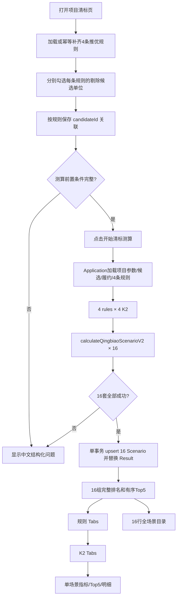

# 新版清标 Web 流程

本文档记录 2026-08-24 Step 5 实际上线的新版清标 Application / Repository / UI 契约。路由继续为 `/projects/[id]/qingbiao`。

## 1. 用户流程



## 2. 推优剔除规则配置

页面展示“规则1”至“规则4”四张 Card，不创造 Excel 未签署的业务名称。每张 Card 的候选项来自当前 `ProjectCandidate`，展示单位名称、投标报价、净下浮率与我方标记。

净下浮率遵守 fraction contract：数据库/Domain 的 `0.1038` 由 UI 显示为 `10.38%`。

保存输入只包含：

```text
projectId
exclusionRuleId
candidateIds[]
```

Repository 在事务内校验规则属于项目、候选 ID 属于同一项目、ID 不重复且不能剔除全部候选；然后删除该规则旧关联并创建新关联。该操作的删除始终以 `exclusionRuleId` 为范围。允许保存 0 个剔除单位，此时 K1 使用全部候选。

## 3. 测算前置条件

“开始清标测算”只在以下条件满足时可用：

- 项目参数存在；
- 至少有 1 个候选单位；
- 4 条 exclusion rule 均存在；
- 没有尚未保存的规则草稿；
- 每条规则剔除后至少剩 1 个 K1 候选；
- 所有排名候选按项目类型需要的履约数据完整。

前端禁用按钮只是交互优化；Application/Domain/Repository 仍会重新校验，不信任浏览器状态。

## 4. Application 与 Domain 契约

`calculateAllQingbiaoScenarios(projectId)` 是批量清标用例入口。Application 不重写 K1、B、得分或排名公式，而是针对每个 `ruleIndex=1..4` 与 `qingbiaoK2Value=0..3` 调用 Step 4 的 `calculateQingbiaoScenarioV2()`。

当前显式策略为：

```text
K1 candidates = all candidates - current rule excluded candidates
Ranking candidates = ALL_CANDIDATES
```

因此被剔除单位不进入该规则 K1 样本，但仍会出现在该场景报价排名、综合评分、最终排名和可能的 Top5 中。这是当前对 Excel 结构的临时解释，尚待业务签署。

履约继续按“候选单位名称 + 项目类型 + 最近 12 季度”查询。多专业先分别平均，再对专业平均值等权平均。缺失不默认为 0，而是阻止整批计算。

## 5. 事务与重算

`saveCalculationV2()` 先在事务中重读项目修订、候选和规则关系，并验证整批 16 场景。验证通过后：

1. 按 `(exclusionRuleId, qingbiaoK2)` upsert 场景；
2. 按该 `scenarioId` 删除旧 `QingbiaoResult`；
3. 写入该场景所有排名候选的新结果；
4. 16 场景全部成功后才 commit；
5. 任一关键校验、修订冲突或写入失败则 rollback。

重算不会创建第 17 个场景；原场景 ID 保持稳定，原结果被完整替换。删除始终按具体场景限定，不存在无项目/场景范围的 `deleteMany({})`。

## 6. 结果页结构

结果页按两级导航展示：

```text
规则1
  -> K2=0% / 1% / 2% / 3%
规则2
  -> K2=0% / 1% / 2% / 3%
规则3
  -> K2=0% / 1% / 2% / 3%
规则4
  -> K2=0% / 1% / 2% / 3%
```

同一规则顶部只展示一个规则 K1。单场景展示规则、K1、K2、参考报价 B、候选数、我方排名/是否 Top5、有序 Top5 和全部计算明细。商标优与技术优可查看，但明确标记不计入综合分。

我方单位只依据 `isOurCompany`用 Badge 和行底色强调，不硬编码任何公司名。未设置我方单位时显示“未设置我方单位”，不报错。

## 7. 全场景目录 API

`getQingbiaoScenarioCatalog(projectId)` 返回：

```ts
type ScenarioCatalog = {
  inputRevision: number;
  ruleVersion: string;
  scenarios: Array<{
    scenarioId: string;
    exclusionRuleId: string;
    ruleIndex: 1 | 2 | 3 | 4;
    qingbiaoK2Value: 0 | 1 | 2 | 3;
    qingbiaoK1Fraction: string;
    referencePriceB: string;
    top5: Array<{
      candidateId: string;
      companyName: string;
      finalRank: number;
      isOurCompany: boolean;
    }>;
  }>;
};
```

“全场景入围单位”即这 16 套带 `scenarioId` 和 `finalRank` 的有序 Top5。它不是公司名称并集，同一单位出现在多个场景时必须保留每个场景的独立身份和排名。

## 8. 结果状态与兼容

- `not_calculated`：没有完整的 16 条 `qingbiao-20260820-v2` 场景；历史项目会显示空状态，不崩溃。
- `current`：16 条结果修订与项目当前 `qingbiaoInputRevision` 一致。
- `stale`：已保存结果存在，但项目输入修订已变化。页面可供对照查看，但显示明确过期警告。

规则、项目参数和候选变更已接入修订失效。公共履约数据变更尚未能反向递增所有受影响项目修订，是当前已知限制。

底层继续保留旧字段与 legacy 路径。规则 1 的四个新场景暂时标记 `isLegacy=true` 以支持未修改的定标和 analysis；新版清标查询与 UI 不依赖该标志。

## 9. 本步骤未改动范围

本步骤未修改 Prisma schema/migration、Step 4 V2 Domain 核心与 Golden fixture、定标 Domain/UI、`calculateFinalBenchmarkPrice()`、analysis 或 report，也未批量生成 144 套定标结果。
